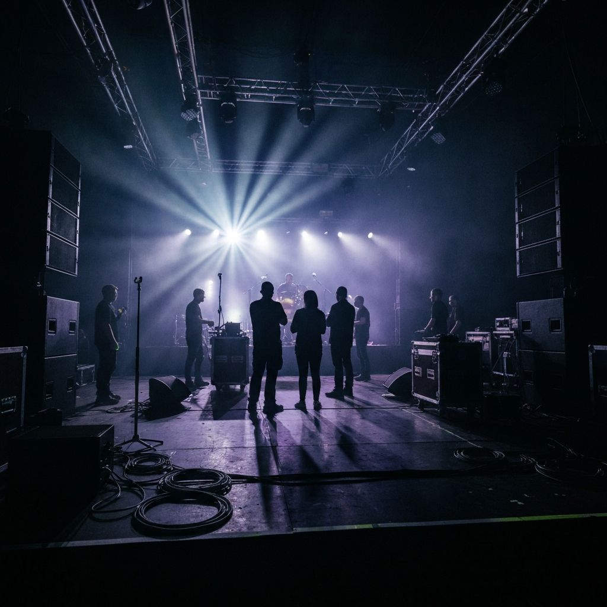

# We Up Music Group — Music Label & Artist Management Platform



A cinematic, editorial-grade web platform and template for **We Up Music Group** — a premier music video placement, editorial playlisting, and artist development agency founded by **Sid Mali**, an entertainment industry veteran with 15+ years of global experience.

---

## 🌟 Overview

**We Up Music Group** connects emerging and established talent with major networks, DSP editorial playlists, satellite/terrestrial radio stations, and international broadcast outlets across the U.S. and African markets.

### Key Capabilities & Placements
- **Music Video Placements:** MTV (MTV U, MTV Live, MTV Spankin' New, MTV Yo, MTV Biggest Pop, MTV News), BET (BET Soul, BET HER, BET Gospel), VeVo Music, Music Choice.
- **Editorial Playlisting:** Apple Music, Spotify, Pandora Radio, SoundCloud, Apple Radio.
- **Radio & Media Interviews:** SiriusXM (The Heat, Shade45, Heart & Soul), iHeart Radio, Hot 97, Fat Joe & Jadakiss Podcast.
- **International Broadcast:** Metro FM (South Africa), YFM, Radio 2000, 5FM, Channel O Africa, Trace TV Africa, MTV Base Africa.
- **Performance Platforms:** On The Radar, Bar 4 Bar.
- **Artist Management:** 360° career strategy, image development, booking coordination, PR & media management.

### Featured Clients
Worked with prominent artists across Hip-Hop, R&B, and contemporary music:
- **Jack Harlow** · **Lil Baby** · **T.I.** · **Benny The Butcher** · **DreamDoll** · **Young Dolph** · **Maino** · **Bobby Valentino** · **OJ Da Juiceman** · **Young Chop** · **41 (The Group)** · **Kai Ca$h** · **Connie Diamond** · **Eastside Jody**

---

## 🎨 Design System & Aesthetic

Built in accordance with the **Site Empire OS** and **Design Taste** standards:
- **Color Palette:** Luxury dark & gold theme
  - Background: Obsidian Black (`#000000`)
  - Elevated Cards: Deep Charcoal (`#1A1A1A`)
  - Accent / Highlights: Metallic Gold (`#D4AF37`)
  - Text: Clean White (`#FFFFFF`) & Slate Gray (`#A3A3A3`)
- **Typography:** Inter with modern typographic hierarchy and tracking
- **Motion:** Micro-interactions, infinite marquee client ticker, and smooth scroll behaviors

---

## 📁 Project Structure

```
├── app/
│   ├── about/             # Founder biography (Sid Mali), career timeline & photo gallery
│   ├── contact/           # High-conversion inquiry form with service selectors
│   ├── faq/               # Accordion-driven FAQ covering campaigns & requirements
│   ├── roster/            # Past clients & featured artists directory
│   ├── services/          # Detailed service breakdowns & platform catalogs
│   ├── globals.css        # Tailwind v4 configuration and design tokens
│   ├── layout.tsx         # Root layout with dark mode, metadata & analytics
│   └── page.tsx           # High-impact landing page
├── components/
│   ├── clients-carousel.tsx   # Continuous scrolling marquee of past clients
│   ├── cta-banner.tsx         # Reusable conversion CTA banner
│   ├── footer.tsx             # Global footer with contact info & site links
│   ├── hero-section.tsx       # Fullscreen hero with stats & primary CTAs
│   ├── navigation.tsx         # Responsive sticky header with mobile sheet
│   ├── placements-section.tsx # Network & DSP placement directory
│   ├── services-overview.tsx  # Core offering grid
│   └── ui/                    # Accessible Radix UI component primitives
├── public/
│   ├── images/            # Curated industry photos with top artists & executives
│   └── *.jpg              # Studio, concert, and broadcast photography
└── package.json
```

---

## 🚀 Getting Started

### Prerequisites
- Node.js 18.17+ or 20+
- pnpm (recommended), npm, or yarn

### Installation
```bash
# Clone the repository
git clone https://github.com/diamitani/music-label-template.git

# Navigate to project directory
cd music-label-template

# Install dependencies
pnpm install
```

### Running Locally
```bash
pnpm dev
```
Open [http://localhost:3000](http://localhost:3000) with your browser to view the application.

### Building for Production
```bash
pnpm build
pnpm start
```

---

## 📄 License & Attribution

- **Founder & CEO:** Sidima "Sid" Mali — [We Up Music Group, LLC](mailto:sidmali2@gmail.com)
- **Engineered by:** [Diamitani](https://github.com/diamitani)
